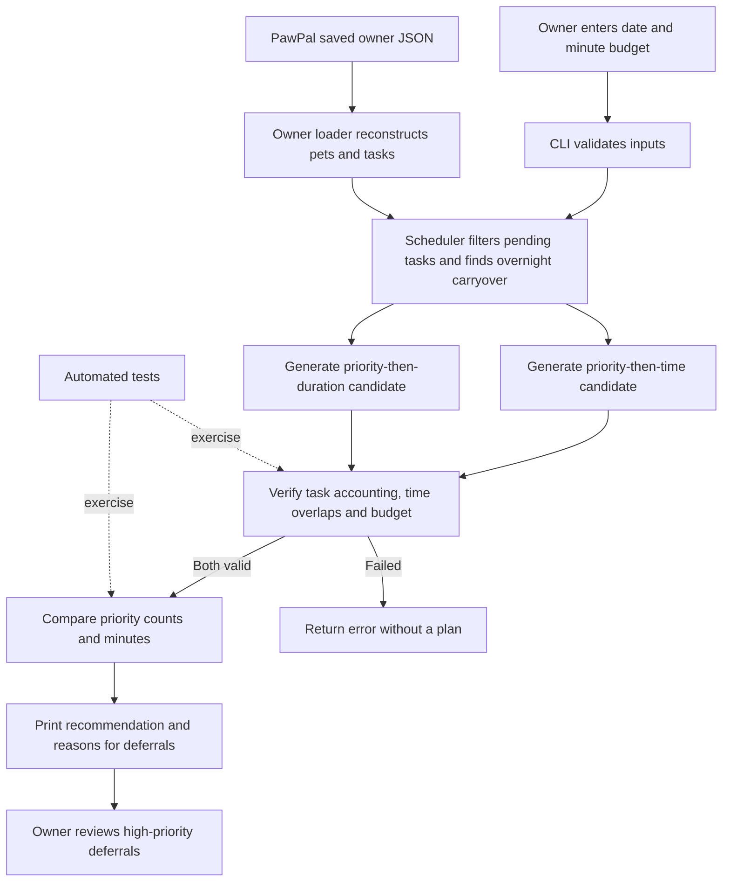

# System architecture

```mermaid
flowchart TD
    A["Owner enters date and minute budget"] --> C["CLI validates inputs"]
    B["PawPal saved owner JSON"] --> D["Owner loader reconstructs pets and tasks"]
    C --> E["Scheduler filters pending tasks and finds overnight carryover"]
    D --> E
    E --> F["Generate priority-then-time candidate"]
    E --> G["Generate priority-then-duration candidate"]
    F --> H["Verify task accounting, time overlaps and budget"]
    G --> H
    H -->|Both valid| I["Compare priority counts and minutes"]
    H -->|Failed| J["Return error without a plan"]
    I --> K["Print recommendation and reasons for deferrals"]
    K --> L["Owner reviews high-priority deferrals"]
    M["Automated tests"] -. exercise .-> H
    M -. exercise .-> I
```
